# Construction Theme

> Custom WordPress Theme & Content Management System

---

# 🇹🇷 Türkçe

## 📌 Proje Hakkında

**Construction Theme**, inşaat, tadilat, restorasyon, iç mimarlık, dekorasyon ve benzeri kurumsal işletmeler için geliştirilmiş özel bir **WordPress tema ve içerik yönetim sistemi** projesidir.

Proje; modern ve responsive bir frontend yapısını, WordPress üzerinde geliştirilen özel bir yönetim arayüzüyle bir araya getirir.

Temel amaç, kurumsal web sitelerinde kullanılan içerik ve yapılandırmaların doğrudan tema dosyalarına müdahale edilmeden yönetilebilmesini sağlayan, yeniden kullanılabilir bir altyapı oluşturmaktır.

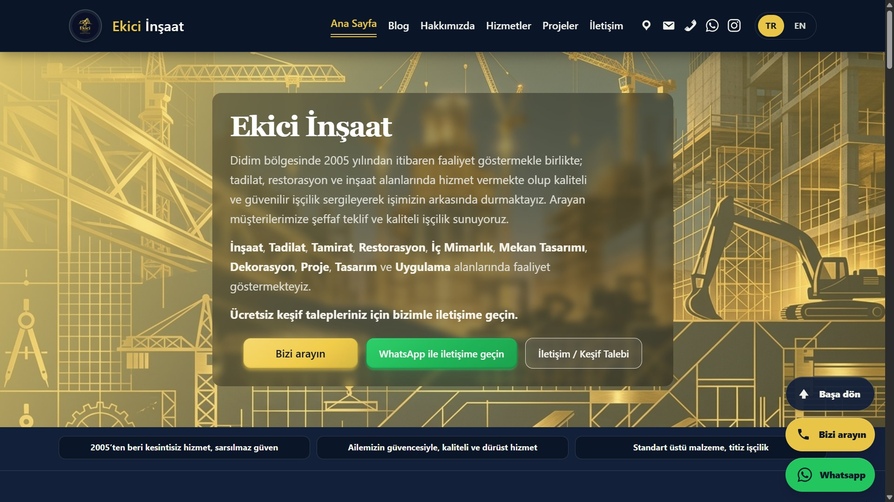

---

## ✨ Özellikler

### 🌐 Frontend

- Modern kurumsal web tasarımı
- Responsive tasarım
- Masaüstü, tablet ve mobil uyumluluk
- Özel ana sayfa bölümleri
- Hakkımızda / Kurumsal içerik
- Hizmetler bölümü
- Proje / Portföy bölümü
- Blog sistemi
- İletişim sayfası
- Responsive navigasyon
- Özelleştirilebilir header ve footer yapısı
- Dinamik içerik gösterimi

---

### ⚙️ Özel İçerik Yönetimi

Tema, WordPress yönetim paneli içerisinde özel olarak geliştirilmiş bir yönetim arayüzü içerir.

Bu arayüz üzerinden aşağıdaki alanlar yönetilebilir:

- Ana sayfa içerikleri
- Hakkımızda içerikleri
- Hizmetler
- Projeler
- Blog ayarları
- İletişim bilgileri
- Header / Footer ayarları
- Website görünürlük seçenekleri
- Özel arayüz metinleri
- Tema ayarları
- SEO ayarları

Bu yapı sayesinde sık değiştirilen içeriklerin düzenlenmesi için tema kaynak koduna doğrudan müdahale edilmesine gerek kalmaz.

---

## 🖥️ Özel Yönetim Paneli

Projenin önemli bölümlerinden biri, WordPress'in standart yönetim deneyiminin üzerine geliştirilen özel yönetim panelidir.

### Yönetim Paneli Bölümleri

```text
Construction Theme
├── Genel
├── Ana Sayfa
├── Hakkımızda
├── Hizmetler
├── Projeler
├── Blog Ayarları
├── İletişim
└── SEO Ayarları
```

### Yönetim Paneli

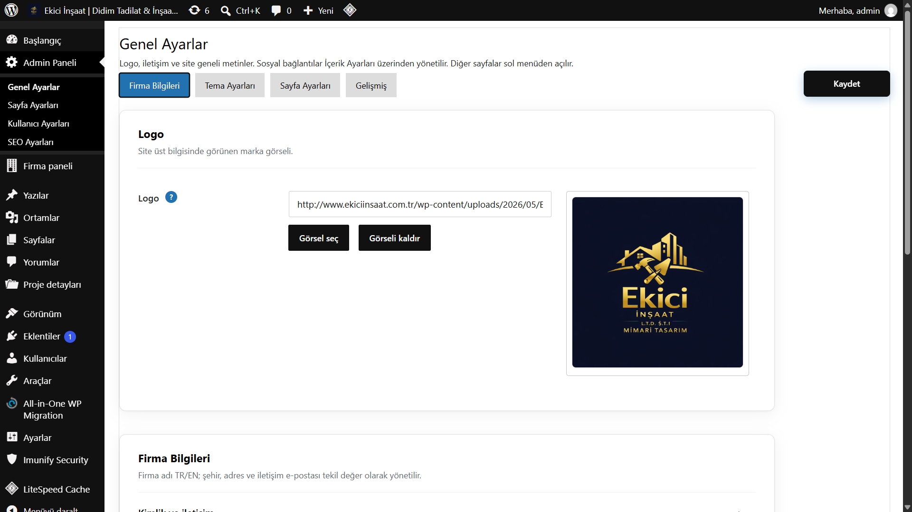

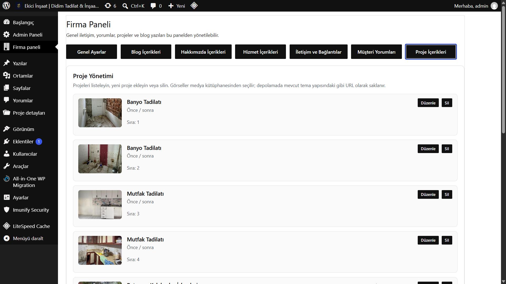

---

## 🌍 Çoklu Dil Desteği

Proje **Türkçe ve İngilizce** içerik desteğine sahiptir.

Dil yapısı; farklı diller için içeriklerin ayrı şekilde yönetilebilmesini ve gerekli durumlarda varsayılan içeriklerin kullanılabilmesini sağlayacak şekilde tasarlanmıştır.

Desteklenen başlıca alanlar:

- Navigasyon
- Ana sayfa
- Hakkımızda
- Hizmetler
- Projeler
- Blog
- İletişim
- Arayüz metinleri
- SEO içerikleri

---

## 🔎 SEO Özellikleri

Tema içerisinde kurumsal ve yerel işletme web siteleri için yapılandırılabilir SEO özellikleri bulunmaktadır.

### Desteklenen özellikler

- Özel sayfa başlıkları
- Meta açıklamaları
- Open Graph metadata
- Structured Data / Schema
- Yerel SEO ayarları
- Arama motoru doğrulama desteği
- Özel SEO ayarları
- Dil bazlı SEO içerikleri

SEO ile ilgili önemli bilgilerin yönetim panelinden düzenlenebilmesi hedeflenmiştir.

---

## 📱 Responsive Tasarım

Frontend yapısı farklı ekran boyutlarına uyum sağlayacak şekilde geliştirilmiştir.

### Masaüstü — Türkçe


### Mobil — Türkçe

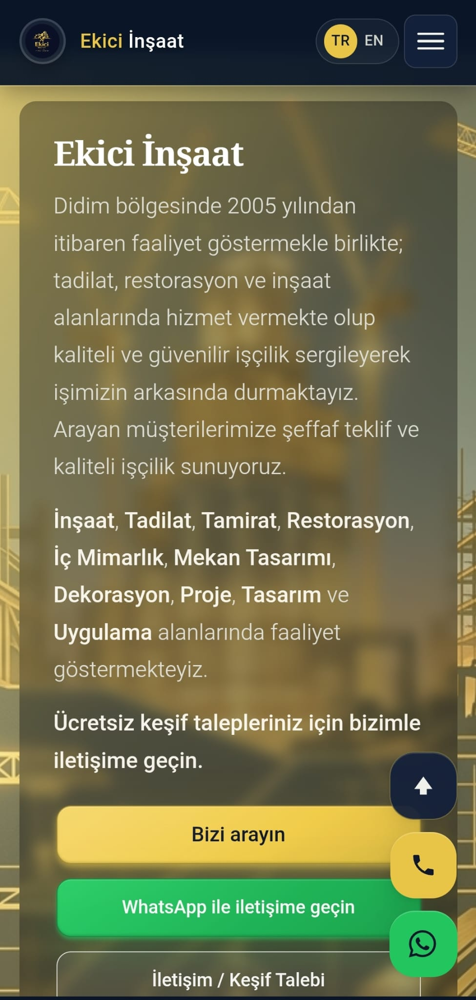

---

## 🖼️ Türkçe Ekran Görüntüleri

### Ana Sayfa


### Hakkımızda

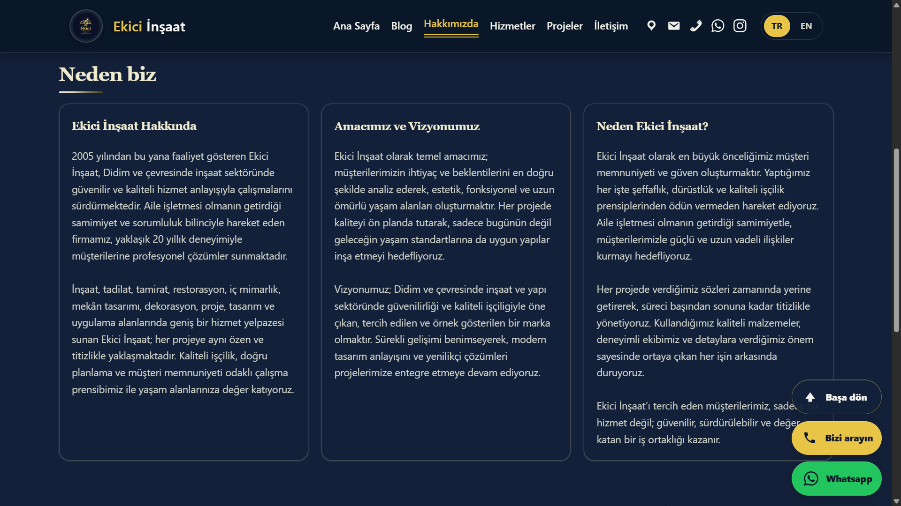

### Hizmetler

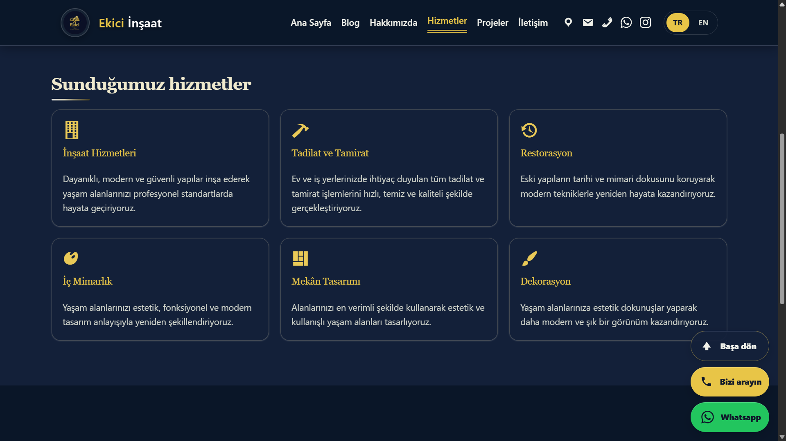

### Projeler

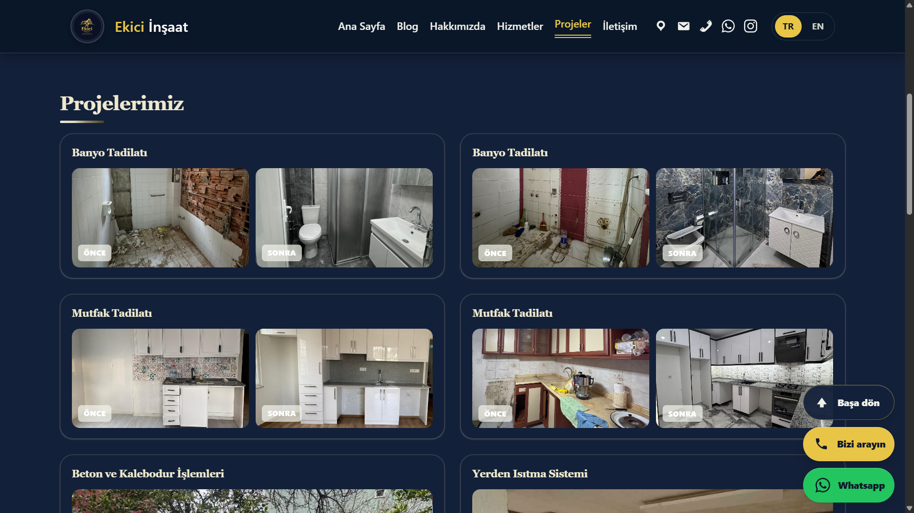

### Blog

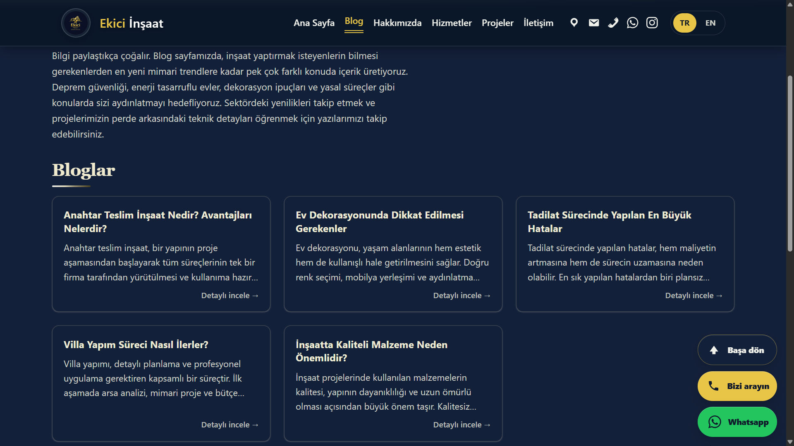

### İletişim

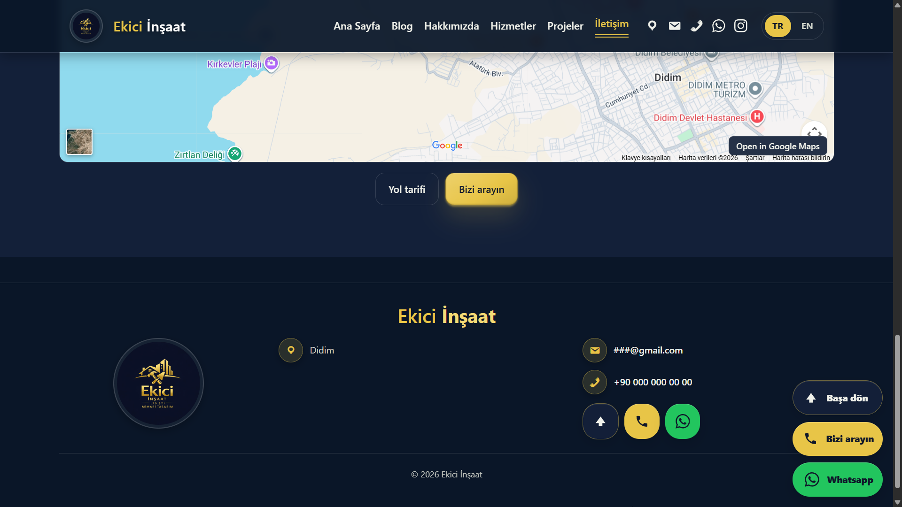

---

## 🛠️ Kullanılan Teknolojiler

- **WordPress**
- **PHP**
- **MySQL**
- **HTML5**
- **CSS3**
- **JavaScript**
- **Responsive Web Design**
- **SEO / Structured Data**

---

## 🏗️ Proje Yapısı

Bu repository, projenin **tanıtım ve dokümantasyon** amacıyla hazırlanmıştır.

Üretimde kullanılan tema kaynak kodları bu repository içerisinde yer almamaktadır.

```text
Construction_Theme/
│
├── README.md
│
└── screenshots/
    ├── homepage_tr.jpg
    ├── mobile-homepage_tr.jpg
    ├── about_tr.png
    ├── services_tr.png
    ├── project_tr.png
    ├── blog_tr.png
    ├── contact_tr.png
    │
    ├── homepage_en.jpg
    ├── mobile-homepage_en.jpg
    ├── about_en.png
    ├── services_en.png
    ├── project_en.png
    ├── blog_en.png
    ├── contact_en.png
    │
    ├── panel1.png
    └── panel2.png
```

---

## 🎯 Proje Amaçları

Projenin temel amaçları:

1. İnşaat ve benzeri kurumsal işletmeler için modern bir web sitesi altyapısı oluşturmak.
2. Responsive ve mobil uyumlu bir kullanıcı deneyimi sağlamak.
3. Website içeriklerinin doğrudan kod düzenlemeden yönetilebilmesini sağlamak.
4. Tema ayarlarını özel bir yönetim panelinde merkezi olarak yönetmek.
5. Türkçe ve İngilizce içerik desteği sağlamak.
6. Yapılandırılabilir SEO özellikleri sunmak.
7. Farklı kurumsal web sitelerine uyarlanabilecek yeniden kullanılabilir bir temel oluşturmak.

---

## 📋 Proje Durumu

**Durum: Tamamlandı**

Projenin temel frontend, içerik yönetimi, çoklu dil ve tema yapılandırma özellikleri tamamlanmıştır.

Proje, gelecekte yapılabilecek geliştirme ve iyileştirmelere açıktır.

---

## 🔐 Repository Kapsamı

Bu repository, **Construction Theme** projesinin tanıtımı ve teknik dokümantasyonu amacıyla oluşturulmuştur.

Üretim ortamında kullanılan:

- Tema kaynak kodları
- Özel uygulama kodları
- Lisanslama mekanizmaları
- Deployment dosyaları
- Ortama özel yapılandırmalar

repository içerisinde paylaşılmamaktadır.

Repository temel olarak aşağıdaki içerikleri sunmaktadır:

- Proje tanıtımı
- Tasarım örnekleri
- Ekran görüntüleri
- Özellik dokümantasyonu
- Teknik bilgiler

---

## 👨‍💻 Geliştirici

**Erebus Heros**

GitHub: [@kahraman114](https://github.com/kahraman114)

---

## ⭐ Proje Özeti

**Construction Theme**, özel bir WordPress kurumsal web sitesi altyapısının geliştirilmesini gösteren bir projedir.

Proje özellikle:

**Tasarım · İçerik Yönetimi · Responsive Tasarım · Çoklu Dil · SEO · Özel Yönetim Paneli**

alanlarına odaklanmaktadır.

---

# 🇬🇧 English

## 📌 About the Project

**Construction Theme** is a custom **WordPress theme and content management system** designed for construction, renovation, restoration, interior design, decoration and other corporate businesses.

The project combines a modern and responsive frontend with a custom administration interface developed within WordPress.

The main goal is to provide a reusable foundation where website content and configuration can be managed without directly modifying the theme source code.

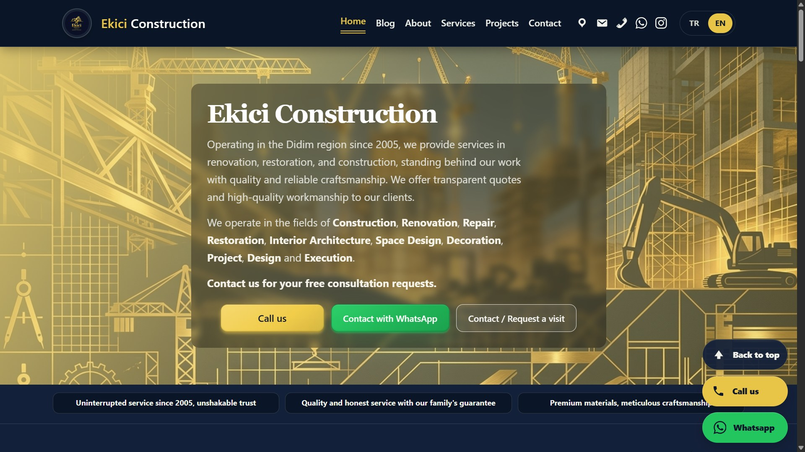

---

## ✨ Features

### 🌐 Frontend

- Modern corporate web design
- Fully responsive layout
- Desktop, tablet and mobile support
- Custom homepage sections
- About / Company information
- Services section
- Project / Portfolio section
- Blog system
- Contact page
- Responsive navigation
- Customizable header and footer
- Dynamic content presentation

---

### ⚙️ Custom Content Management

The theme includes a custom administration interface developed within the WordPress dashboard.

The following areas can be managed through the custom interface:

- Homepage content
- About / Company information
- Services
- Projects
- Blog settings
- Contact information
- Header / Footer settings
- Website visibility options
- Custom interface texts
- Theme settings
- SEO settings

This approach reduces the need to directly modify theme source files when updating frequently changing website content.

---

## 🖥️ Custom Administration Panel

One of the main components of the project is its custom administration interface built on top of the standard WordPress dashboard.

### Administration Sections

```text
Construction Theme
├── Genel
├── Ana Sayfa
├── Hakkımızda
├── Hizmetler
├── Projeler
├── Blog Ayarları
├── İletişim
└── SEO Ayarları
```

### Administration Panel

The administration panel is currently presented in Turkish.


---

## 🌍 Multilingual Support

The project supports **Turkish and English** content.

The multilingual structure is designed to allow content to be managed separately for different languages while providing fallback behavior when a translated version is not available.

Supported areas include:

- Navigation
- Homepage
- About
- Services
- Projects
- Blog
- Contact
- Interface texts
- SEO content

---

## 🔎 SEO Features

The theme includes configurable SEO functionality designed for corporate and local business websites.

### Supported Features

- Custom page titles
- Meta descriptions
- Open Graph metadata
- Structured Data / Schema
- Local SEO settings
- Search engine verification support
- Custom SEO configuration
- Language-specific SEO content

Important SEO-related information can be configured through the administration interface.

---

## 📱 Responsive Design

The frontend is designed to adapt to different screen sizes and devices.

### Desktop — English


### Mobile — English

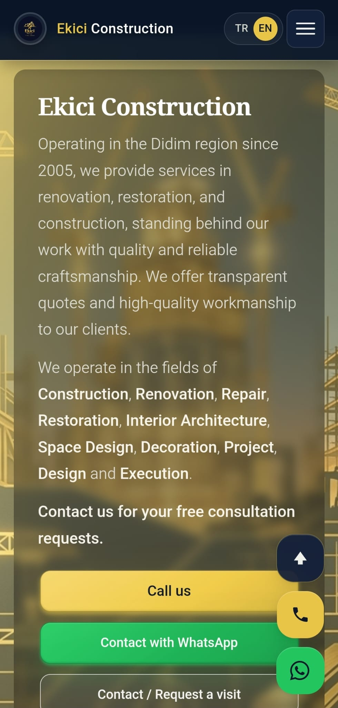

---

## 🖼️ English Screenshots

### Homepage


### About

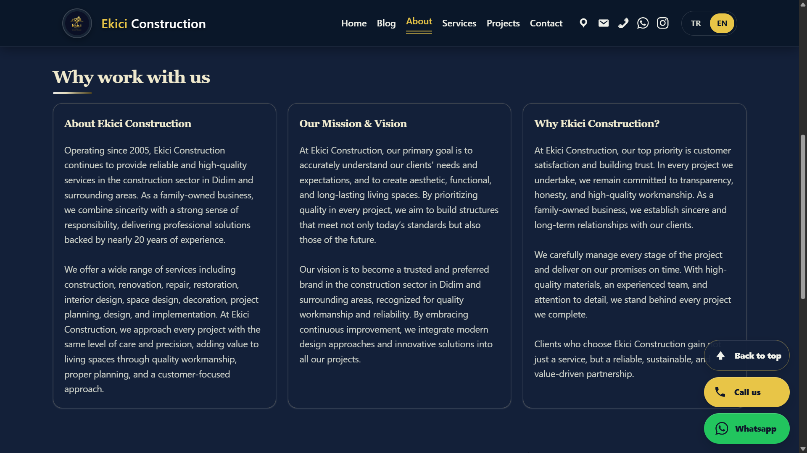

### Services

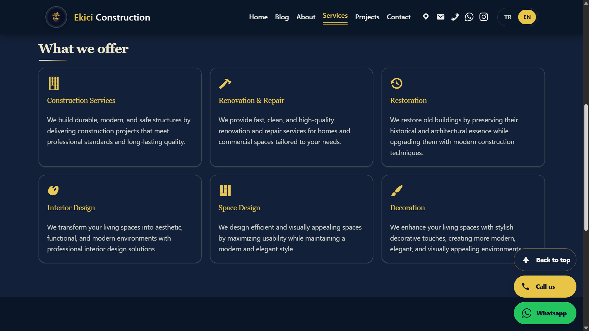

### Projects

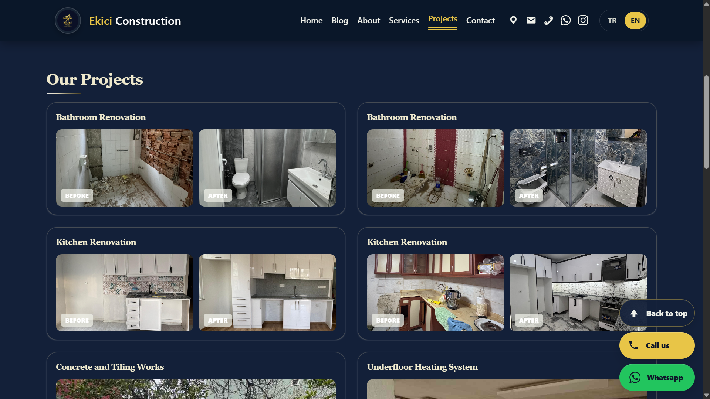

### Blog

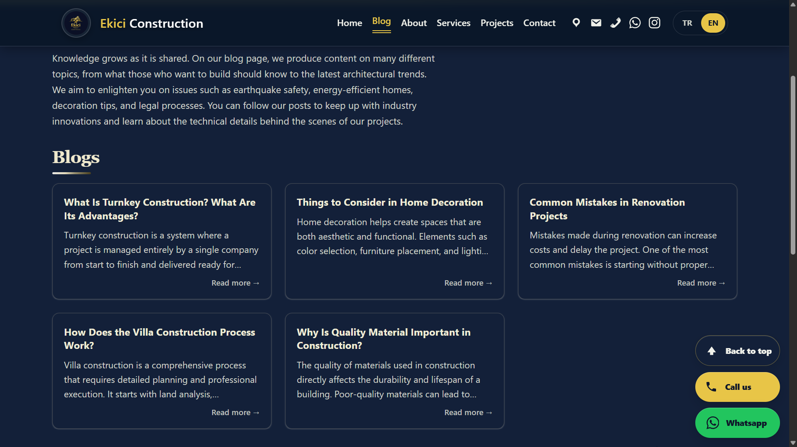

### Contact

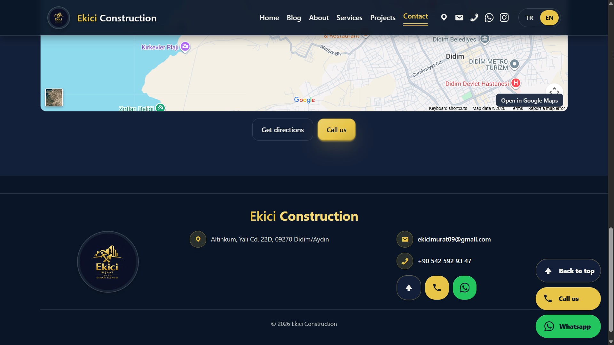

---

## 🛠️ Technologies

- **WordPress**
- **PHP**
- **MySQL**
- **HTML5**
- **CSS3**
- **JavaScript**
- **Responsive Web Design**
- **SEO / Structured Data**

---

## 🏗️ Project Structure

This repository is intended as a **project showcase and documentation repository**.

The production theme source code is not included.

```text
Construction_Theme/
│
├── README.md
│
└── screenshots/
    ├── homepage_tr.jpg
    ├── mobile-homepage_tr.jpg
    ├── about_tr.png
    ├── services_tr.png
    ├── project_tr.png
    ├── blog_tr.png
    ├── contact_tr.png
    │
    ├── homepage_en.jpg
    ├── mobile-homepage_en.jpg
    ├── about_en.png
    ├── services_en.png
    ├── project_en.png
    ├── blog_en.png
    ├── contact_en.png
    │
    ├── panel1.png
    └── panel2.png
```

---

## 🎯 Project Goals

The main goals of the project are:

1. Build a modern corporate website foundation for construction-oriented businesses.
2. Provide a responsive and mobile-friendly user experience.
3. Allow website content to be managed without directly editing source code.
4. Centralize theme configuration through a custom administration interface.
5. Support Turkish and English content.
6. Provide configurable SEO functionality.
7. Establish a reusable foundation that can be adapted to different corporate websites.

---

## 📋 Project Status

**Status: Completed**

The core frontend, content management, multilingual and theme configuration functionality has been completed.

The project remains open to future improvements and refinements.

---

## 🔐 Repository Scope

This repository is intended to showcase and document the **Construction Theme** project.

The following production-related components are not included:

- Theme source code
- Proprietary implementation details
- Licensing mechanisms
- Deployment files
- Environment-specific configuration

The repository focuses on:

- Project presentation
- Design examples
- Screenshots
- Feature documentation
- Technical overview

---

## 👨‍💻 Developer

**Erebus Heros**

GitHub: [@kahraman114](https://github.com/kahraman114)

---

## ⭐ Project Summary

**Construction Theme** demonstrates the development of a custom WordPress-based corporate website system with a focus on:

**Design · Content Management · Responsive Design · Multilingual Support · SEO · Custom Administration**

The project was developed as a practical implementation of a reusable corporate website foundation rather than as a simple static website template.